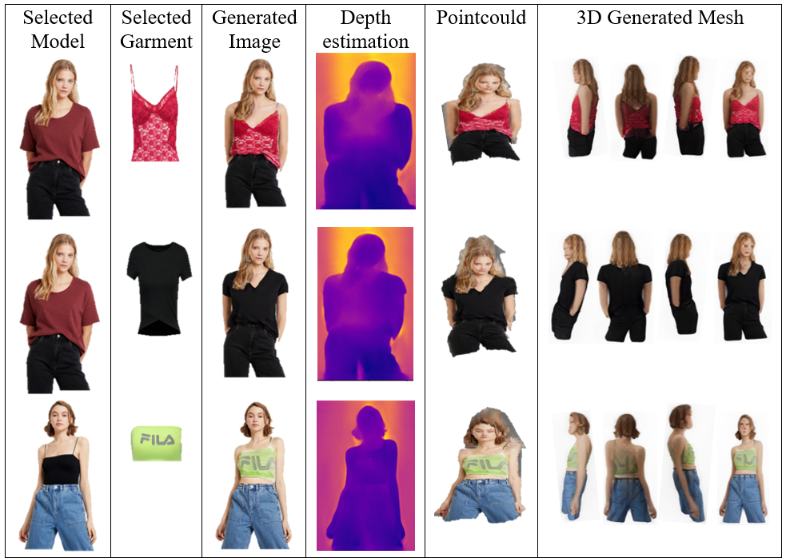

# DIF3D_VITON: 3D Model Generation from Images


Table of Contents:
- [Repository map](#repositorymap)
- [Introduction](#introduction)
- [Motivation](#motivation)
- [contribution](#contribution)
- [Setup](#setup)
- [Usage](#usage)
- [Configuration](#configuration)
- [Results](#results)
- [Methodology](#methodology)
-[Conclusion](#conclusion)


## Repositorymap
```
    DIF3D-VITON
    │
    ├── output/
    │   ├── 3dfiles   
    │   ├── images
    │   └── renderfiles
    │
    ├── viton/
    │   ├── Data   
    │   ├── eval
    │   └── * other files
    |
    ├── tsr/ [*for more information you can visit DIF3D @*]
    │    
    ├── .gitignore
    ├── README.md
    ├── LICENSE
    ├── dif3d_viton_ENV.yml
    ├── dif3d_viton.py
    └── demo.ipynb
```
## Introduction


## Motivation


## Achivements and contributions


## Setup
To be able to use the code firstly, run the following command :
```bash
git clone git@github.com:Mehdialmoo/DIF3D-VITON.git
```
To install the required packages, and set up the environment, you will need to have conda installed on your system.
Once you have conda installed, you can create a new environment with the following command:
```bash
conda env create -f dif3d_viton_ENV.yml
```
This will create a new conda environment named dif3d_viton_ENV with all the required dependencies.
Once the environment is set up, you can activate it with the following command:

```bash
conda activate dif3d_viton_ENV
```
You can then run the DIF3D-VITON project within this environment. now you need to download the required files from [Kaggle](https://www.kaggle.com/datasets/mehdialmousavie/dif3d-viton-files-data-checkpoints).After downloading the required files you need to unzip the files the copy the required files into the following address:

* ### ./viton/

by compeleting these steps, the system is now ready to use!

## Usage
To use the runtime environment, follow these steps:

create a python file or jupyter notebook file, first cell you only need to call one class from Dif3d_viton.py as show below:
```python
from dif3d_viton import dif3D_Viton
``` 
After this step, you need  to create an instance from Runtime class to be able to use the modules. as follows:
```python
test = dif3D_Viton()
```
### Configuration
now, we recommend to leave values as defult but if you have the intreset you can change the values for better textured mesh, for a better output we recommend enabling rendering, but this will add extra time towards resulting an output.

```
defualt vales are :
    render = False
    chunk_size: int = 8192, #check your VRAM
    padding: int = 16, #for CNN model padding
    foreground_ratio: float = 0.85, 
    #for depth estimation of foreground and background
    mc_resolution: int = 256, #final mesh resloution
```
all of these variables are reacheable using the dif3d_viton_run method. like the code below:
```python
test.dif3d_viton_run(render=True)
```
after setting the variables, you can run the cell/ python file. after running the code there should appear a menu of models and a menu of garments follow the instructions below for reaching out the output.

until now if you have followed you will notice the program created a out put folder with three sub folders of different outputs what will be produced during the work.

## Results
Runing the code completley will show case models and garments for selection, after selecting and the system goes through preprocessing, VTO deforming and fitting then for 3D generation, finally results and saves the final results in a folder named output as defualt (but you can change that also)The runtime environment generates the following output:

+ ####  Processed images in the output/images/ directory.
+ #### Rendered images in the output/renderfiles/ directory.
+ #### A video of the rendered images in the output/renderfiles/ directory.
+ #### A 3D mesh in the output/3dfiles/ directory.

now let us look into different experiments that have been done:

for more details here are the examples as  rendered videos:

https://github.com/user-attachments/assets/9722abb3-683b-4eb0-93b6-bef0ae492f3f
https://github.com/user-attachments/assets/040d020e-45ce-4510-8503-5c11533740d6  
https://github.com/user-attachments/assets/f720418b-c707-419f-bb33-193b3d9a0d64


## Methodology

### System
we conducted experiments on a personal computer running Windows 11. The hardware configuration included an Nvidia 4080 graphics card with 8GB VRAM and an Intel Gen 13th CPU with 16GB RAM
## Conclusion

