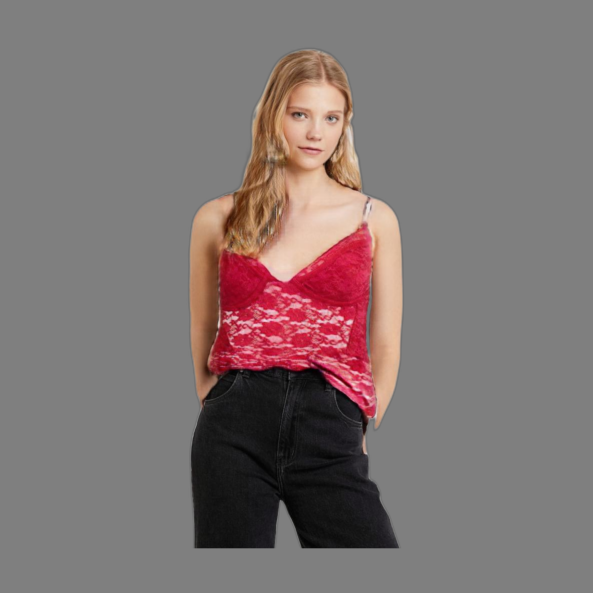
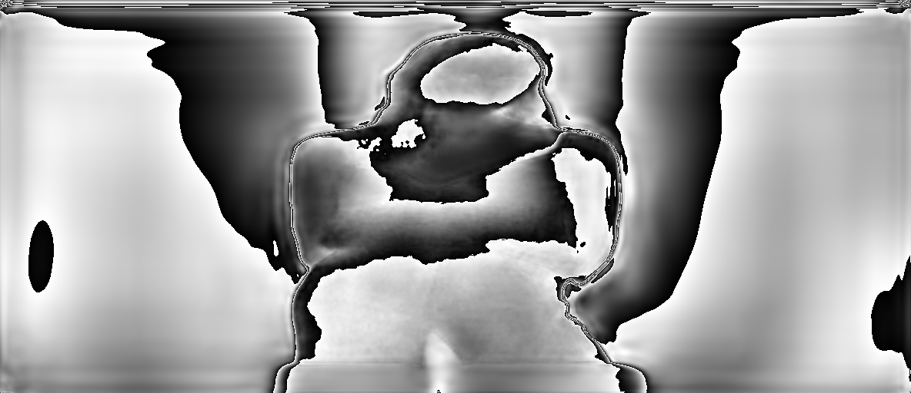
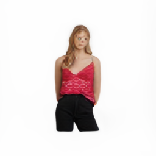
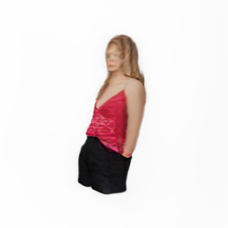
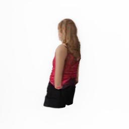
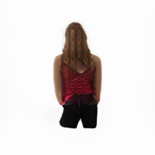
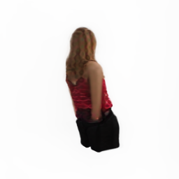
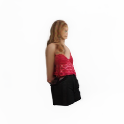

# DIF3D: 3D Model Generation from Images


Table of Contents:
- [Repository map](#repositorymap)
- [Introduction](#introduction)
- [Motivation](#motivation)
- [contribution](#contribution)
- [Setup](#setup)
- [Usage](#usage)
- [Configuration](#configuration)
- [Results](#results)
- [Methodology](#methodology)
    + [Dif3d](#dif3d)
    + [Utils](#utils)
    + [Gaussianutils](#gaussianutils)
    + [System](#system)
-[Conclusion](#conclusion)


## Repositorymap
```
    DIF3D-VITON
    │
    ├── output/
    │   ├── 3dfiles   
    │   ├── images
    │   └── renderfiles
    │
    ├── viton/ [**]
    │    
    ├── tsr/ [**]
    │    
    ├── .gitignore
    ├── README.md
    ├── LICENSE
    ├── dif3d_viton_ENV.yml
    ├── dif3d_viton.py
    └── demo.ipynb
```
## Introduction


## Motivation


## Contribution


## Setup
To be able to use the code firstly, run the following command :
```bash
git clone 
```
To install the required packages, and set up the environment, you will need to have conda installed on your system.
Once you have conda installed, you can create a new environment with the following command:
```bash
conda env create -f 
```
This will create a new conda environment named dif3d_ENV with all the required dependencies.
Once the environment is set up, you can activate it with the following command:

```bash
conda activate 
```
You can then run the dif3d project within this environment.

## Usage
To use the runtime environment, follow these steps:

create a python file or jupyter notebook file, first cell you only need to call one class from Dif3d.py as show below:
```python

``` 
After this step, you need  to create an instance from Runtime class to be able to use the modules. as follows:
```python

```
### Configuration
now, Set the input image path, we recommend to leave other values as defult but if you have the intreset you can change the addresses or fine tune the TSR and Gausssian models.
other variables are as follows:

```
output_path
pre-trained_model_name
chunk_size
padding
foreground_ratio
resolution(mesh_extraction_resolution)
format(model_save_format )
```
all of these variables are reacheable using the set_variables method. like the code below:
```python
B3D_fusiion.set_variables(input_path="picture_adrress")
```
after setting the variables, you can initilize the models based on the variables as follows:
```python
B3D_fusiion.initilize()
```
now, you can run the main blocks of our work to start the image process as follows:
```python
B3D_fusiion.img_process()
```
until now if you have followed you will notice the program created a out put folder with three sub folders of different outputs what will be produced during the work. We will be discussing this in [Results]() section.
next you need to Initialize the pre-model and TSR model using the initilize method to be able to run and gen 3d result from mesh , point cloud and forfront depth estimations. using below code

```python
B3D_fusiion.modelRun()
```
Render the 3D model using the render method to generate mising point cloud areas.
method.
```python
B3D_fusiion.render()
```
Finally to Export the 3D mesh in the specified format using the export_mesh :
```python
B3D_fusiion.export_mesh()
```
Here's an example usage:

```python

    input_path="input/",
    output_path="output/",
    pretrained_model="stabilityai/TripoSR",
    chunk_size=8192,
    padding=16,
    foreground_ratio=0.85,
    mc_resolution=256,
    model_save_format="obj"
```
all the steps are already been coded in workspace.ipynb file as well.
## Results
Runing the code completley will show case preprocessing results and saves the final results ina folder named output as defualt (but you can change that also)The runtime environment generates the following output:

+ ####  Processed images in the output/images/ directory.
+ #### Rendered images in the output/renderfiles/ directory.
+ #### A video of the rendered images in the output/renderfiles/ directory.
+ #### A 3D mesh in the output/3dfiles/ directory.

now let us look into one of the experiments that have been done using the below picture



after running the model it generated the following depth map:



and the rendering and 3D results are as follows:








another example:
using the below picture


after running the model it generated the following depth map:


and the rendering and 3D results are as follows:


## Methodology


### Dif3d


### System


## Conclusion

